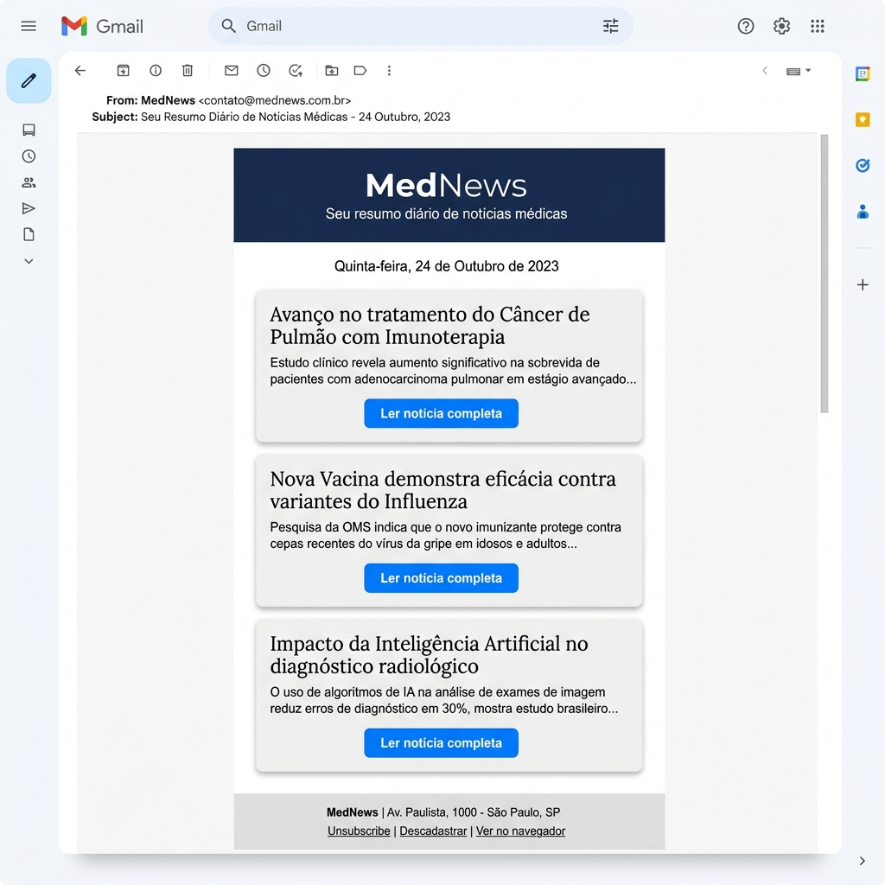

# 🏥 MedNews - Seu Resumo Diário de Medicina

<p align="center">
  
</p>

[](https://www.python.org/)
[](https://opensource.org/licenses/MIT)
[](#metodologia-de-desenvolvimento)

**MedNews** é um pipeline automatizado de inteligência médica que coleta as notícias mais recentes de fontes confiáveis, traduz para o português usando modelos de linguagem de ponta e entrega um resumo elegante diretamente na sua caixa de entrada.

---

## 🚀 Funcionalidades

- **Coleta Inteligente**: Integração com feeds RSS médicos (atual: [Medical Xpress](https://medicalxpress.com/rss-feed/)).
- **Tradução com IA**: Tradução técnica e contextual de Inglês para Português usando **Groq (Llama 3.1 8B)**.
- **Resumo Executivo**: Filtragem automática de campos essenciais (título, sumário, data e link).
- **Design Premium**: Envio de e-mails em HTML responsivo com estética moderna e profissional.
- **Robusto**: Tratamento de erros para falhas de rede, limites de taxa (rate limiting) e inconsistências no feed.

---

## 🛠️ Tech Stack

- **Linguagem**: [Python](https://www.python.org/)
- **Processamento de Dados**: [Pandas](https://pandas.pydata.org/)
- **RSS Parser**: [Feedparser](https://pythonhosted.org/feedparser/)
- **Inteligência Artificial**: [Groq Cloud](https://groq.com/) (LLM API)
- **Comunicação**: `smtplib` para entrega de e-mails.
- **Qualidade**: [Pytest](https://docs.pytest.org/) para testes unitários e de integração.

---

## 📦 Estrutura do Projeto

```text
.
├── assets/                 # Ativos de documentação (imagens, mockups)
├── specs/                  # Especificações técnicas e planos de ação
│   ├── get_data_from_rss/  # Módulo de extração
│   └── send_news_via_email/# Módulo de entrega
├── src/                    # Código fonte
│   ├── main.py             # Ponto de entrada da aplicação
│   ├── rss_fetcher.py      # Coleta de feeds
│   ├── filter_rss_data.py  # Limpeza e normalização
│   ├── translator.py       # Tradução via Groq
│   └── email_sender.py     # Construção e envio de HTML
├── tests/                  # Suite de testes Pytest
├── requirements.txt        # Dependências do projeto
└── .env                    # Variáveis de ambiente (não versionado)
```

---

## ⚙️ Configuração e Instalação

### 1. Clonar e Instalar
```bash
# Criar ambiente virtual
python -m venv venv
source venv/bin/activate  # Linux/macOS

# Instalar dependências
pip install -r requirements.txt
```

### 2. Variáveis de Ambiente
Crie um arquivo `.env` na raiz do projeto com as seguintes chaves:

```env
# Groq API Configuration
GROQ_API_KEY=your_groq_api_key_here

# SMTP Configuration
SMTP_SERVER=smtp.gmail.com
SMTP_PORT=587
SENDER_EMAIL=seu-email@gmail.com
SENDER_PASSWORD=sua-senha-de-app

# Recipient
SUBSCRIBER_EMAIL=destino@email.com
```

---

## 🏃 Como Usar

Para executar o pipeline completo (coleta -> tradução -> envio):

```bash
python src/main.py
```

---

## 🧪 Metodologia de Desenvolvimento

Este projeto segue rigorosamente a metodologia **TDD (Test-Driven Development)**:
1. **Red**: Escrever um teste que falha.
2. **Green**: Escrever o código mínimo para o teste passar.
3. **Refactor**: Melhorar o código mantendo os testes passando.

Além disso, aplicamos os princípios **KISS**, **DRY** e **YAGNI** em cada commit.

Para rodar os testes:
```bash
python -m pytest
```

---

## 🤝 Contribuição

Atualmente, o projeto foca no feed do Medical Xpress, mas estamos abertos a sugestões de novos feeds e melhorias na filtragem de dados baseada no feedback dos usuários.

---

## 📄 Licença

Este projeto está sob a licença MIT. Veja o arquivo [LICENSE](LICENSE) para detalhes.

---
Developed with ❤️ by MedNews Team